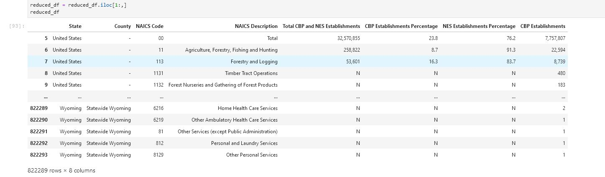
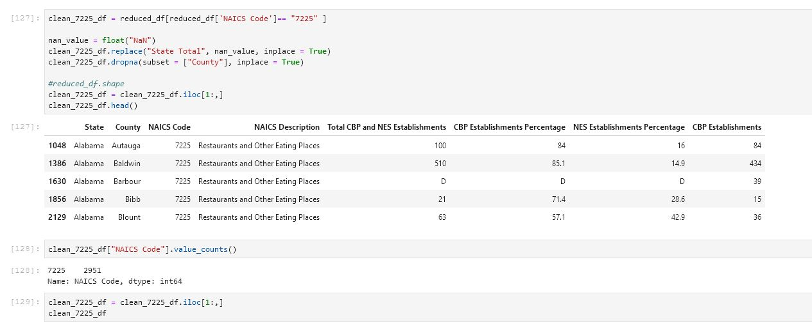
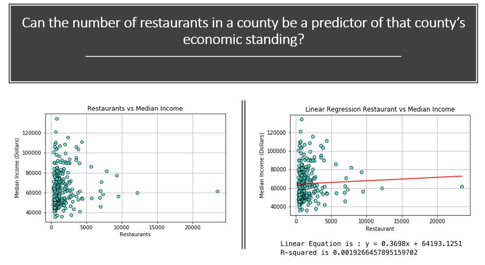
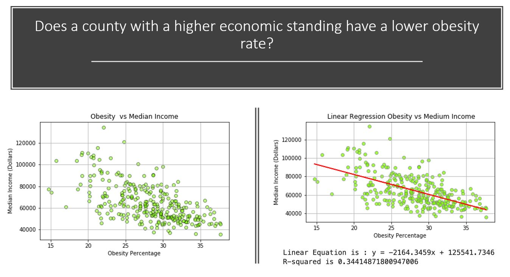
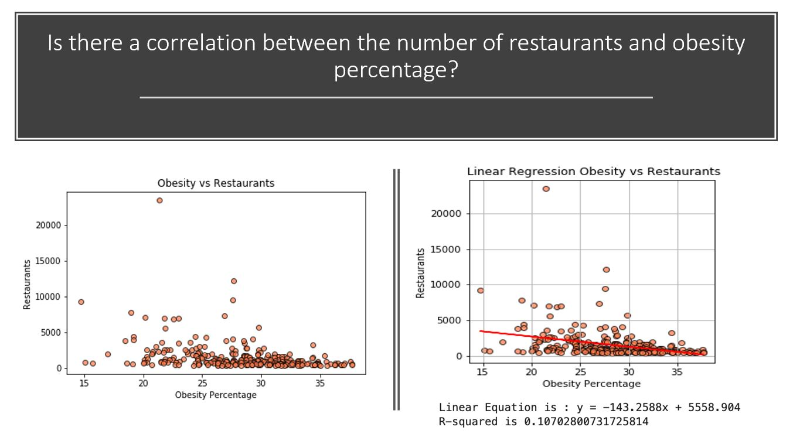
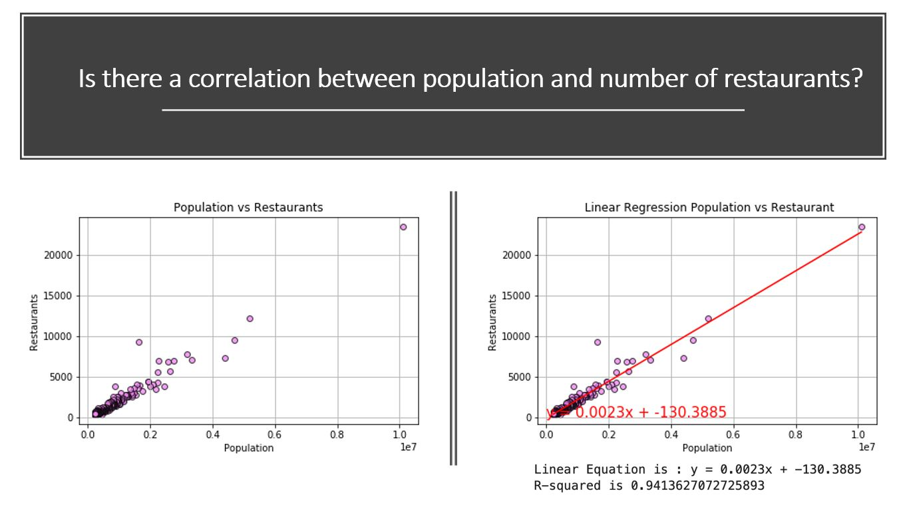

# Obesity and Possible Links

## Purpose 
See if there is a correlation between the number and type of restaurants and obesity rate in the top 300 cities by population
 
 - Additonal questions to address
    - Does the amount of restaurants in a city equal a higher obesity rate
    - Can the type of restaurant in a city be a predictor of a citys economic standing
    - Does a city with a higher economic standing have a lower obesity rate
    - Is there a particular correlation between cuisine/type of restaurant and obesity
    - Is there a correlation between economic status and cuisine 

## Process and Results

### Data collection utilizing Census.gov and NAICS.com
 

### Cleaning data in Jupyter Lab utilizing Pandas
 

### Finalizing data clean up 
 

### Plotting data after data clean up
 
 
 
 

 # Summary
 No links were found between the number and type of restaurants in a given geographic area and obesity rates

#### Contributors
- Quentin Sloboda - https://github.com/qwsloboda
- Liliana Ilut - https://github.com/liliana-ilut

